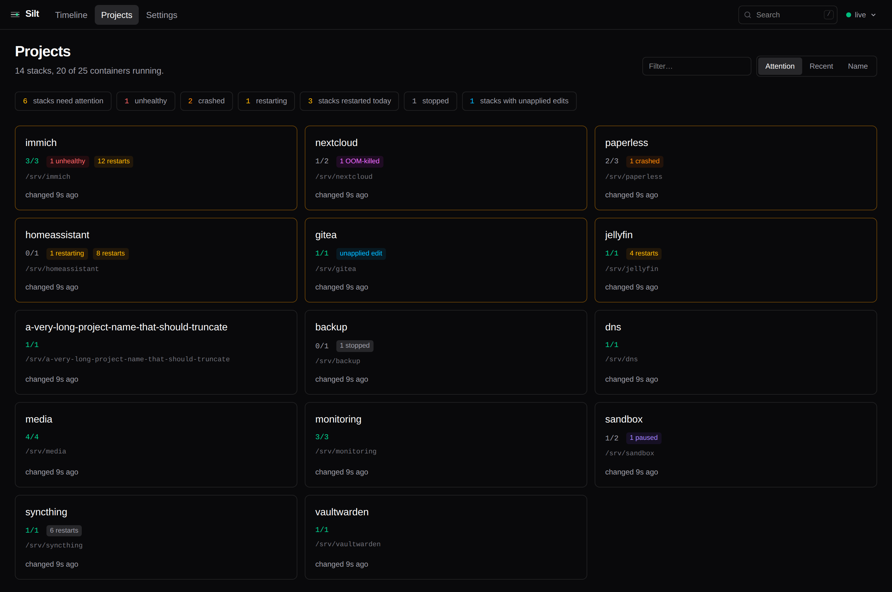
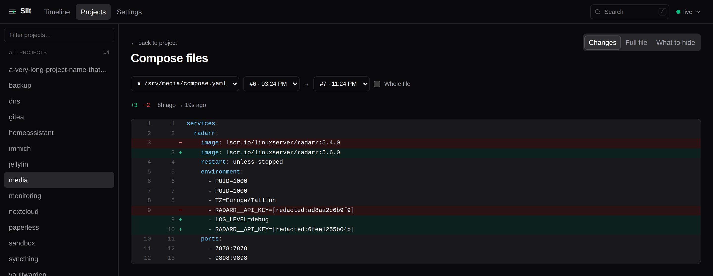

<div align="center">


<h1>Silt</h1>

<p>A self-hosted change journal for Docker Compose stacks.<br />
<em>What settled on your stack, and when.</em></p>

<p>
  <a href="https://github.com/unmaykr-a/silt/releases"></a>
  <a href="https://github.com/unmaykr-a/silt/pkgs/container/silt"></a>
  <a href="LICENSE"></a>
  <a href="https://github.com/unmaykr-a/silt/actions/workflows/ci.yml"></a>
  <a href="https://ko-fi.com/unmaykr"></a>
</p>

<p><b><a href="https://unmaykr-a.github.io/silt/">Try the live demo →</a></b><br />
<sub>The whole UI, in your browser, against a made-up host. Nothing to install.</sub></p>

<br />


</div>

<br />

## Overview

Silt watches your Docker host and records, over time, the effective configuration of every
Compose project, the resolved image identity of every service, container state, and a
stream of events — then lets you answer one question well: **what changed, and when?**

When something breaks at 03:10, you can see the image that got pulled at 03:00.

Silt **never writes to the Docker API.** It observes, through a read-only socket proxy.
That is an architectural rule, not a v1 shortcut.

<br />

## Features

<table>
<tr>
<td width="50%" valign="top">

**One timeline:**
Config changes and health events share a single axis, because a change and the outage it
might explain are only useful side by side. Drag to zoom, filter by project or severity,
and expand a burst in place rather than losing your position.

</td>
<td width="50%" valign="top">

**Diffs between any two snapshots:**
Grouped by service, then by kind, and coloured by severity — an image digest moving is
high, a label is low. Structured or as YAML, with a real unified diff you can `git apply`.

</td>
</tr>
<tr>
<td width="50%" valign="top">

**Secrets that were never stored:**
Environment values are redacted by default and recorded as a truncated HMAC under a
per-install key. A changed digest proves the value changed while being useless to anyone
holding the database file.

</td>
<td width="50%" valign="top">

**Compose files, line by line:**
The files themselves are captured on every change, redacted value by value, with every
comment, indent and image tag left exactly as written. A rotated key is a visibly changed
line and nothing more.

</td>
</tr>
<tr>
<td width="50%" valign="top">

**Unapplied edits:**
Editing a compose file and forgetting to `up` breaks nothing today; it lands weeks later
at the next unrelated restart. Silt compares what is on disk against what is running and
keeps saying so until you apply it.

</td>
<td width="50%" valign="top">

**A fleet view that ranks by trouble:**
Unhealthy, crashed, OOM-killed and restarting are four different problems and get four
colours. A container you stopped yourself is grey, because colouring a deliberate stop red
is how a dashboard teaches you to ignore red.

</td>
</tr>
<tr>
<td width="50%" valign="top">

**Per-service history:**
When the image actually changed and to what, restarts over time, and the points at which
each environment key's value changed — without the value ever having been stored.

</td>
<td width="50%" valign="top">

**Search that does not lie:**
Press `/` for projects, services, environment variable *names*, file paths and event text.
Wildcards are literal, and values are never searchable — a search that matched them would
confirm a guess one query at a time.

</td>
</tr>
<tr>
<td width="50%" valign="top">

**Notifications:**
Any [shoutrrr](https://containrrr.dev/shoutrrr/) target — ntfy, Gotify, Discord, Telegram,
email — filtered by change kind *and* severity. **Send a test** reports each target
separately, so a wrong URL is found now rather than during the outage.

</td>
<td width="50%" valign="top">

**External events:**
Point Uptime Kuma, a cron job or a Home Assistant automation at the ingest webhook and its
events land on the same axis as your config changes.

</td>
</tr>
</table>

<details>
<summary><b>More features</b></summary>

<br />

- **Authentication three ways**, tried in order: OpenID Connect, forward auth from a
  reverse proxy, and a built-in account. A fresh install is closed until someone claims it.
- **Sessions are rows, not signed cookies** — they survive a restart, signing out revokes
  them server-side, and one button ends all of them.
- **An audit log** of who changed a setting, who pruned history, who signed in and who was
  refused. It records *what* changed and never what it changed to.
- **Settings editable from the UI**, applied without a container recreate, with each field
  showing whether its value comes from the environment or from here.
- **Choose what to hide**: click any line in a compose file to correct the safe-key list in
  either direction. Hiding takes effect before anything is written.
- **Export a diff**: Markdown for an issue, or a unified diff `patch -p1` will take.
- **Per-viewer preferences** — 24-hour or 12-hour, date order, relative or absolute
  timestamps, top bar or left rail — stored in the browser, not on the install.
- **Restart counters that decay.** Docker's never resets, so one blip three months ago
  would pin a stack to the attention list forever.
- **Prometheus metrics** at `/metrics`, plus `/healthz` and `/readyz` that stay reachable
  whatever the authentication.
- **Content-addressed storage**: identical content is stored once, and an unchanged
  observation updates the previous row rather than inserting one. An idle hour of
  five-minute snapshots across 40 services costs zero bytes.

</details>

<br />

## Screenshots

<div align="center">
<table>
<tr>
<td valign="top" width="50%"><br /><sub><b>Projects</b> — what is running, what is broken, what was edited and never applied.</sub></td>
<td valign="top" width="50%"><br /><sub><b>Diff</b> — one <code>compose up</code>: an upgrade, a rotated key, a new setting.</sub></td>
</tr>
<tr>
<td valign="top" width="50%"><br /><sub><b>Compose files</b> — the changed line, with the secret still a digest.</sub></td>
<td valign="top" width="50%"><br /><sub><b>Service history</b> — images, restarts, and when each value last changed.</sub></td>
</tr>
</table>
</div>

<br />

## Quick start

```bash
curl -O https://raw.githubusercontent.com/unmaykr-a/silt/main/docker-compose.yml
docker compose up -d
```

Open `http://<host>:8375` and set a password. Silt discovers your Compose projects from the
labels Docker Compose already writes; there is nothing to configure to get started.

The socket proxy in that file is not optional decoration. Mounting
`/var/run/docker.sock:ro` into Silt directly would **not** be a security boundary:
read-only applies to the file, not to the API, so anything holding it can still create
privileged containers. The proxy enforces read-only at the HTTP verb level with `POST=0`,
and it lets Silt run as a non-root user with no docker group membership.

To capture the compose files themselves, mount your compose directories read-only at the
same paths they have on the host, and allowlist them:

```yaml
environment:
  SILT_COMPOSE_ROOTS: /srv,/opt
volumes:
  - /srv:/srv:ro
  - /opt:/opt:ro
```

`SILT_COMPOSE_ROOTS` is an allowlist, not a hint. The paths Silt would otherwise follow
come from container labels, and anyone who can start a container sets those, so nothing
outside these roots is ever read — symlinks included.

<br />

## Configuration

Copy `.env.example` to `.env` and uncomment what you need — every setting has a working
default, so an empty `.env` is a valid one.

```sh
cp .env.example .env
```

Environment variables are the baseline; most can also be changed on the Settings screen,
which stores the change on top of the environment and applies it immediately. The full
table is in [`PROJECT.md`](PROJECT.md#13-config-reference); the ones people actually change:

| Variable | Default | Purpose |
|---|---|---|
| `SILT_DOCKER_HOST` | `tcp://docker-socket-proxy:2375` | Docker API endpoint |
| `SILT_LISTEN_ADDR` | `:8375` | |
| `SILT_DB_PATH` | `/data/silt.db` | |
| `SILT_COMPOSE_ROOTS` | *(empty)* | Directories compose files may be read from |
| `SILT_SNAPSHOT_INTERVAL` | `5m` | Reconcile cadence |
| `SILT_RETENTION_DAYS` | `365` | Snapshots whose configuration changed |
| `SILT_UNCHANGED_RETENTION_DAYS` | `7` | Runtime-only snapshots (restarts, health) |
| `SILT_EVENT_RETENTION_DAYS` | `90` | Events |
| `SILT_KEEP_KEYS` | *(empty)* | Extra env keys kept readable |
| `SILT_NOTIFY_URLS` | *(empty)* | shoutrrr targets |
| `SILT_INGEST_TOKEN` | *(empty)* | Enables the webhook |
| `SILT_LOG_LEVEL` | `info` | |

<details>
<summary><b>Notifications, webhooks and reverse proxies</b></summary>

<br />

**Notifications.** Kinds and severity are ANDed: a change must be of a listed kind *and*
meet the threshold. Either alone lets through far more than you want — a host running
Watchtower produces image changes constantly.

```yaml
SILT_NOTIFY_URLS: ntfy://ntfy.sh/my-silt-topic
SILT_NOTIFY_ON: image_id,image_digest,volumes,service_removed
SILT_NOTIFY_MIN_SEVERITY: medium
SILT_BASE_URL: https://silt.example.com   # makes notifications link to the diff
```

A shoutrrr URL has no feedback loop: it is wrong until something tries to send, and the
only thing that tries to send is the change that mattered. Failures are masked in the UI —
providers quote the request URL back at you, and a shoutrrr URL is a credential.

**External events.** Set `SILT_INGEST_TOKEN` to enable the webhook; unset, it returns 503
rather than accepting anything. The token works as `Authorization: Bearer` or `?token=`,
because not every webhook source can set headers.

```bash
curl -X POST 'http://silt:8375/api/ingest?token=YOUR_TOKEN' \
  -d '{"type":"monitor.down","service":"radarr","severity":"error","message":"Radarr is down"}'
```

**Behind a reverse proxy.** Silt pushes live updates over server-sent events. Behind nginx
or Nginx Proxy Manager, set `proxy_buffering off;` on the location, or events arrive in
batches minutes late instead of as they happen:

```nginx
location / {
    proxy_pass http://silt:8375;
    proxy_buffering off;
    proxy_read_timeout 3600s;
}
```

</details>

<details>
<summary><b>Authentication</b></summary>

<br />

**A fresh install is closed.** Silt has a built-in administrator from first boot, and the
first thing it asks for is a password. Until you set one, every request is refused and the
UI serves only the setup form. Set `SILT_PASSWORD_HASH` to claim the account before Silt
ever starts, and the window between the container starting and someone claiming it never
exists.

| Variable | Purpose |
|---|---|
| `SILT_OIDC_ISSUER` | Enables OpenID Connect. Point it at your provider's issuer URL. |
| `SILT_OIDC_CLIENT_ID` / `SILT_OIDC_CLIENT_SECRET` | The client you registered. |
| `SILT_OIDC_REDIRECT_URL` | Defaults to `$SILT_BASE_URL/api/auth/callback`. |
| `SILT_OIDC_ALLOWED_GROUPS` / `SILT_OIDC_ALLOWED_USERS` | Optional. Both empty admits anyone the provider authenticates. |
| `SILT_OIDC_GROUPS_CLAIM` / `SILT_OIDC_USERNAME_CLAIM` | Default `groups` and `preferred_username`; providers disagree. |
| `SILT_TRUST_PROXY_AUTH` + `SILT_AUTH_HEADER` | Believe an identity your reverse proxy asserts. |
| `SILT_TRUSTED_PROXIES` | **Set this** if you use forward auth. See below. |
| `SILT_PASSWORD_HASH` | bcrypt: `htpasswd -bnBC 12 "" yourpassword \| tr -d ':\n'` |
| `SILT_LOCAL_ACCOUNT` | `false` removes the built-in account entirely, for an install that authenticates only through a provider. |
| `SILT_SESSION_TTL` / `SILT_SESSION_IDLE_TTL` | Default 30 days and 7 days. |
| `SILT_METRICS_PUBLIC` | Leaves `/metrics` reachable without authentication. Off by default. |

`SILT_TRUSTED_PROXIES` is the whole security of forward auth. The identity header is
settable by anyone who can open a socket, so without a trust list "authenticated" means
"reached the port" — and on a shared Docker network that is every other container on it.

```yaml
SILT_TRUST_PROXY_AUTH: "true"
SILT_AUTH_HEADER: X-Remote-User        # or X-Authentik-Username, etc.
SILT_TRUSTED_PROXIES: "172.18.0.0/16"
```

Some settings are environment-only on purpose. `SILT_LISTEN_ADDR` and `SILT_DB_PATH` cannot
change without a restart; `SILT_DOCKER_HOST`, `SILT_COMPOSE_ROOTS`, `SILT_TRUST_PROXY_AUTH`
and `SILT_PASSWORD_HASH` are the boundary protecting the UI itself, and a UI that could
widen which files Silt reads or turn off the login in front of it would be a way in rather
than a setting.

</details>

<br />

## What Silt stores

Silt reads your Compose environment, so it is built never to persist a recoverable secret.
The threat model is explicit: **someone obtains `silt.db`** — a leaked backup, a
misconfigured volume, a shared debug bundle.

- **Environment values are redacted by default.** Cleartext is kept only for keys on an
  explicit safe list (`PUID`, `PGID`, `TZ`, `LOG_LEVEL`, `*_PORT`, …), extendable with
  `SILT_KEEP_KEYS`. There is no "redact these" pattern to get wrong, because the default is
  to redact. A pattern that would keep more than it names — `*` on its own, say — is
  refused rather than quietly turning redaction off.
- **Redacted values are recorded as a truncated HMAC** under a random key generated on
  first boot, stored in the database and never exported. A bare hash would be a guessing
  oracle: a four-digit PIN is ten thousand hashes.
- **Only a length bucket is stored**, never the exact length.
- **Bind mount source paths are redacted**; type, target, mode and named-volume names are
  kept.
- **Compose `secrets:` and `configs:`** are recorded by name and mount target only, never
  by content.

A test plants a sentinel string in every secret-shaped field, runs a full snapshot write
plus prune and GC, then byte-scans the database file, its WAL, every decompressed blob and
captured debug logs. It runs in CI.

<br />

## Platforms

`linux/amd64` and `linux/arm64`. There is **no `linux/arm/v7` build** and there are no plans
for one — check `uname -m` reports `aarch64` before filing an issue about a failed pull.

## What Silt is not

- **Not a deployment tool.** It observes. Rollback, if it ever exists, means "here is the
  old compose file, go apply it yourself".
- **Not a monitoring system.** It consumes health signals; it does not probe.
- **Not a log aggregator.** Container logs are out of scope.
- **Not Kubernetes.** Compose only.

## Developing

```bash
make demo     # a populated database, no Docker host needed
SILT_DB_PATH=.demo/silt.db go run ./cmd/silt

make check    # gofmt, build, vet, Go tests, frontend tests and build
make e2e      # 118 browser checks against a real binary and that database
make race     # the race detector, which collection earns

make demo-site         # the static demo, built into .demo-site
make demo-site-verify  # drive it in a browser and fail on a screen with no data
```

`make check` is the fast gate and runs exactly what CI runs, in CI's order. `make e2e` is
separate because it builds the frontend, seeds a database and drives a browser — a minute
against a second — and runs as its own CI job.

The published demo is built the same way: the UI compiled with `VITE_SILT_DEMO=1`, and its
`/api` calls answered by a fetch shim reading responses captured from a real Silt running
against the demo database. No screen is special-cased — the components, the API client and
the router are the ones that ship, and only the transport differs. Writes are refused
rather than faked, and every timestamp is shifted onto the reader's clock at load so the
demo does not visibly age between deployments.

## Status

Pre-alpha, under active development. The recording, diffing and UI all work; expect rough
edges and schema changes. [`PROJECT.md`](PROJECT.md) is the full design brief and milestone
plan, including a changelog of every decision that changed during implementation and why.

## License

AGPL-3.0-or-later. Copyright (c) 2026 unmaykr-a. See [`LICENSE`](LICENSE).

The gap Silt fills is a paywalled feature elsewhere; the licence is chosen to keep it from
becoming one again.

## Supporting Silt

Silt is free and AGPL-3.0 licensed, and always will be. If it has saved you an evening of
"what changed?", [a coffee](https://ko-fi.com/unmaykr) is a kind way to say so — and never
required.
