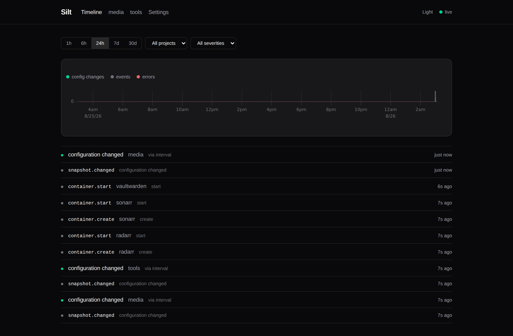
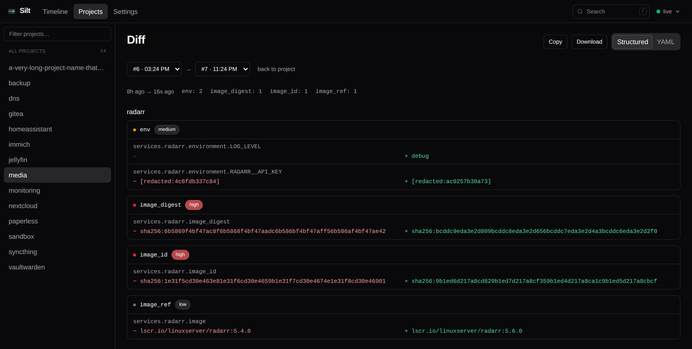
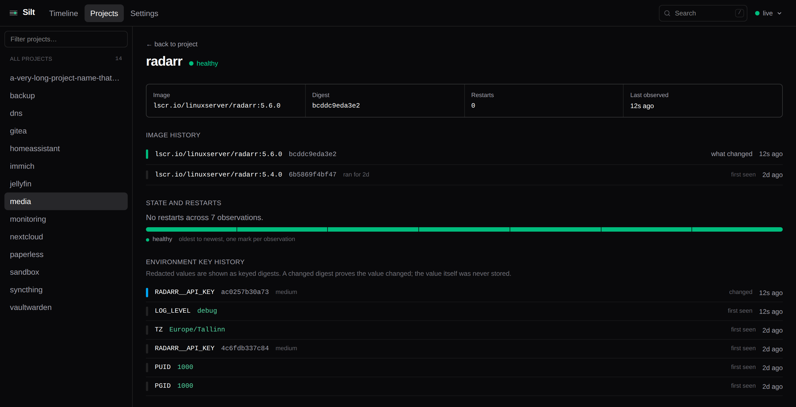

# Silt

*What settled on your stack, and when.*

A self-hosted change journal for Docker Compose stacks. Silt watches your Docker host
and records, over time, the effective configuration of every Compose project, the
resolved image identity of every service, container state, and a stream of events — then
lets you answer one question well: **what changed, and when?**

When something breaks at 03:10, you can see the image that got pulled at 03:00.

Silt **never writes to the Docker API.** It observes, through a read-only socket proxy.
That is an architectural rule, not a v1 shortcut.



Change markers and health events share one axis. That shared axis is the whole point:
config changes on the same timeline as the outage they might explain.



Pick any two snapshots. Changes are grouped by service, then by kind, and coloured by
severity. `image_id` changing is high; a label is low.



Per service: when the image actually changed and to what, restarts over time, and the
points at which each environment key's value changed — without the value ever having
been stored.

---

## Quick start

```bash
curl -O https://raw.githubusercontent.com/unmaykr-a/silt/main/docker-compose.yml
docker compose up -d
```

Open `http://<host>:8375`. Silt discovers your Compose projects automatically from the
labels Docker Compose already writes; there is nothing to configure to get started.

The socket proxy in that file is not optional decoration. Mounting
`/var/run/docker.sock:ro` into Silt directly would **not** be a security boundary:
read-only applies to the file, not to the API, so anything holding it can still create
privileged containers. The proxy enforces read-only at the HTTP verb level with `POST=0`,
and it lets Silt run as a non-root user with no docker group membership.

## What Silt stores

Silt reads your Compose environment, so it is built never to persist a recoverable
secret. The threat model is explicit: **someone obtains `silt.db`** — a leaked backup, a
misconfigured volume, a shared debug bundle.

- **Environment values are redacted by default.** Cleartext is kept only for keys on an
  explicit safe list (`PUID`, `PGID`, `TZ`, `LOG_LEVEL`, `*_PORT`, …), extendable with
  `SILT_KEEP_KEYS`. There is no "redact these" pattern to get wrong, because the default
  is to redact.
- **Redacted values are recorded as a truncated HMAC** under a random key generated on
  first boot, stored in the database and never exported. A bare hash would be a guessing
  oracle — a four-digit PIN is ten thousand hashes. Keyed, the digests still prove *that*
  a value changed while being useless to anyone holding the file.
- **Only a length bucket is stored**, never the exact length.
- **Bind mount source paths are redacted**; type, target, mode and named-volume names are
  kept.
- **Compose `secrets:` and `configs:`** are recorded by name and mount target only, never
  by content.

A test plants a sentinel string in every secret-shaped field, runs a full snapshot write
plus prune and GC, then byte-scans the database file, its WAL, every decompressed blob,
and captured debug logs. It runs in CI.

## Compose files, line by line

Point Silt at your compose directories and it captures the files themselves on every
change, so you can see exactly which line moved:

```yaml
environment:
  SILT_COMPOSE_ROOTS: /srv,/opt
volumes:
  - /srv:/srv:ro     # same path as on the host, so Compose's labels resolve
  - /opt:/opt:ro
```

`SILT_COMPOSE_ROOTS` is an **allowlist**, not a hint. The paths Silt would otherwise
follow come from container labels, and anyone who can start a container sets those, so
nothing outside these roots is ever read — symlinks included.

**The files are redacted line for line.** A compose file can hold a literal secret and a
`.env` file is nothing but secrets, so values are replaced with keyed digests while every
line, comment, indent, image tag and port stays exactly as written:

```diff
     4 -    image: lscr.io/linuxserver/radarr:5.0.0
     4 +    image: lscr.io/linuxserver/radarr:5.4.0
     9 +      - ANALYTICS_DISABLED=[redacted:a04ebe1b1f9c]
    11        - RADARR_API_KEY=[redacted:cdde1b9231f7]
    12        - DB_PASSWORD=${POSTGRES_PASSWORD}
```

A changed secret is a visibly changed line without the value ever being stored.
`${VAR}` references survive, because seeing *which* variable a service reads is worth
noticing.

**A file edited but not applied is drift, not a change.** Silt records it as a
`config.drift` event rather than pretending your running stack moved.

### Choosing what to hide

The built-in safe-key list is a guess. On any file you can open **What to hide** and click
a line to correct it in either direction — hide a value the list missed, or show one it hid
unnecessarily.

That view reads the file live and stores nothing. Hiding takes effect *before* anything is
written, so a hidden value is never stored rather than stored and later concealed. Showing
applies only to future captures: earlier snapshots hold a digest, not the value, so there
is nothing there to uncover.

## Notifications

Set `SILT_NOTIFY_URLS` to any [shoutrrr](https://containrrr.dev/shoutrrr/) target — ntfy,
Gotify, Discord, Telegram, email:

```yaml
SILT_NOTIFY_URLS: ntfy://ntfy.sh/my-silt-topic
SILT_NOTIFY_ON: image_id,image_digest,volumes,service_removed
SILT_NOTIFY_MIN_SEVERITY: medium
SILT_BASE_URL: https://silt.example.com   # makes notifications link to the diff
```

Kinds and severity are **ANDed**: a change must be of a listed kind *and* meet the
threshold. Either alone lets through far more than you want — a host running Watchtower
produces image changes constantly.

## External events

Point Uptime Kuma, a cron job, or a Home Assistant automation at the ingest webhook and
its events land on the same timeline as your config changes:

```bash
curl -X POST 'http://silt:8375/api/ingest?token=YOUR_TOKEN' \
  -d '{"type":"monitor.down","service":"radarr","severity":"error","message":"Radarr is down"}'
```

Set `SILT_INGEST_TOKEN` to enable it; unset, the endpoint returns 503 rather than
accepting anything. The token works as `Authorization: Bearer` or `?token=`, because not
every webhook source can set headers. Events are matched to a project by name, falling
back to the service name.

## Authentication

Silt has no authentication by default, which is right for something you put behind your
own reverse proxy — but it means anyone who can reach the port has full read access.

**Behind a forward-auth proxy** (Authelia, Authentik, tinyauth):

```yaml
SILT_TRUST_PROXY_AUTH: "true"
SILT_AUTH_HEADER: X-Remote-User    # or X-Authentik-Username, etc.
```

**Without an identity provider**, use the password fallback:

```yaml
SILT_PASSWORD_HASH: "$2a$12$..."   # bcrypt; htpasswd -bnBC 12 "" yourpassword | tr -d ':\n'
```

`/healthz`, `/readyz` and `/metrics` stay reachable either way, so probes and Prometheus
scrapes keep working.

## Behind a reverse proxy

Silt pushes live updates over server-sent events. Behind nginx or Nginx Proxy Manager,
set `proxy_buffering off;` on the location, or events arrive in batches minutes late
instead of as they happen:

```nginx
location / {
    proxy_pass http://silt:8375;
    proxy_buffering off;
    proxy_read_timeout 3600s;
}
```

## Configuration

Environment variables are the baseline. Most of them can also be changed on the
Settings screen, which stores the change on top of the environment and applies it
immediately — no container recreate. Each field there says whether its value is coming
from the environment or from the UI, and can be handed back to the environment with one
click.

Some settings are environment-only, and stay that way on purpose. `SILT_LISTEN_ADDR` and
`SILT_DB_PATH` cannot change without a restart; `SILT_DOCKER_HOST`, `SILT_COMPOSE_ROOTS`,
`SILT_TRUST_PROXY_AUTH` and `SILT_PASSWORD_HASH` are the boundary protecting the UI
itself, and a UI that could widen which files Silt reads or turn off the login in front
of it would be a way in rather than a setting.

The full table is in [`PROJECT.md`](PROJECT.md#13-config-reference); the ones people
actually change:

| Variable | Default | Purpose |
|---|---|---|
| `SILT_DOCKER_HOST` | `tcp://docker-socket-proxy:2375` | Docker API endpoint |
| `SILT_LISTEN_ADDR` | `:8375` | |
| `SILT_DB_PATH` | `/data/silt.db` | |
| `SILT_SNAPSHOT_INTERVAL` | `5m` | Reconcile cadence |
| `SILT_RETENTION_DAYS` | `365` | Snapshots whose configuration changed |
| `SILT_UNCHANGED_RETENTION_DAYS` | `7` | Runtime-only snapshots (restarts, health) |
| `SILT_EVENT_RETENTION_DAYS` | `90` | Events |
| `SILT_KEEP_KEYS` | *(empty)* | Extra env keys kept readable |
| `SILT_NOTIFY_URLS` | *(empty)* | shoutrrr targets |
| `SILT_INGEST_TOKEN` | *(empty)* | Enables the webhook |
| `SILT_LOG_LEVEL` | `info` | |

### Signing in

Three ways, tried in that order. With none of them configured Silt is **open** — the right
default for something behind your own proxy, and warned about at startup so it is never a
surprise.

| Variable | Purpose |
|---|---|
| `SILT_OIDC_ISSUER` | Enables OpenID Connect. Point it at your provider's issuer URL. |
| `SILT_OIDC_CLIENT_ID` / `SILT_OIDC_CLIENT_SECRET` | The client you registered. |
| `SILT_OIDC_REDIRECT_URL` | Defaults to `$SILT_BASE_URL/api/auth/callback`. |
| `SILT_OIDC_ALLOWED_GROUPS` / `SILT_OIDC_ALLOWED_USERS` | Optional. Both empty admits anyone the provider authenticates. |
| `SILT_OIDC_GROUPS_CLAIM` / `SILT_OIDC_USERNAME_CLAIM` | Default `groups` and `preferred_username`; providers disagree. |
| `SILT_TRUST_PROXY_AUTH` + `SILT_AUTH_HEADER` | Believe an identity your reverse proxy asserts. |
| `SILT_TRUSTED_PROXIES` | **Set this** if you use forward auth. See below. |
| `SILT_PASSWORD_HASH` | A bcrypt hash, as the fallback when you have neither. |
| `SILT_SESSION_TTL` / `SILT_SESSION_IDLE_TTL` | Default 30 days and 7 days. |
| `SILT_METRICS_PUBLIC` | Leaves `/metrics` reachable without authentication. Off by default. |

`SILT_TRUSTED_PROXIES` is the whole security of forward auth. The identity header is
settable by anyone who can open a socket, so without a trust list "authenticated" means
"reached the port" — and on a shared Docker network that is every other container on it.
Set it to your proxy's address or subnet:

```yaml
SILT_TRUST_PROXY_AUTH: "true"
SILT_TRUSTED_PROXIES: "172.18.0.0/16"
```

Sessions are rows in Silt's database, not signed cookies. They survive a restart, signing
out revokes them server-side, and the Security tab has a button that ends all of them.

Notification URLs are never read back: a shoutrrr URL carries the credential for the
service it points at, so the Settings screen shows the scheme and host and never the
token. The ingest token is the same — set-or-not, never echoed.

Date and time formatting, and whether navigation sits across the top or in a left rail,
are per-viewer preferences stored in the browser rather than settings on the install —
a 24-hour clock is a property of whoever is reading the screen, not of the Docker host.
They are on the Appearance tab of the Settings screen.

Storage is cheap by design: identical content is stored once, and an observation that
matches the previous snapshot updates it in place rather than inserting a row. An idle
hour of five-minute snapshots across 40 services costs **zero bytes**.

## What Silt is not

- **Not a deployment tool.** It observes. Rollback, if it ever exists, means "here is the
  old compose file, go apply it yourself".
- **Not a monitoring system.** It consumes health signals; it does not probe.
- **Not a log aggregator.** Container logs are out of scope.
- **Not Kubernetes.** Compose only.

## Platforms

`linux/amd64` and `linux/arm64`. There is **no `linux/arm/v7` build** and there are no
plans for one — check `uname -m` reports `aarch64` before filing an issue about a failed
pull.

## Status

Pre-alpha, under active development. The recording, diffing and UI all work; expect rough
edges and schema changes. [`PROJECT.md`](PROJECT.md) is the full design brief and
milestone plan, including a changelog of every decision that changed during
implementation and why.

## License

AGPL-3.0-or-later. Copyright (c) 2026 unmaykr-a. See [`LICENSE`](LICENSE).

The gap Silt fills is a paywalled feature elsewhere; the licence is chosen to keep it
from becoming one again.

## Supporting Silt

Silt is free and AGPL-3.0 licensed, and always will be. If it has saved you an evening
of "what changed?", [a coffee](https://ko-fi.com/unmaykr) is a kind way to say so — and
never required.
